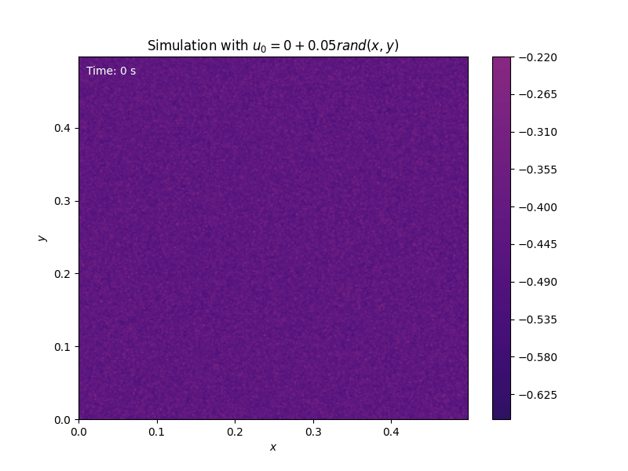

# Cahn-Hilliard Phase Separation Simulation

This project models the phase separation process in a binary alloy system using the Cahn–Hilliard equation, a nonlinear fourth-order partial differential equation describing how concentration evolves due to diffusion and interfacial energy effects.

The simulation captures how initially mixed compositions evolve into distinct regions ("domains") over time due to thermodynamic instabilities, governed by spinodal decomposition dynamics.

---

## Objectives

- Understanding the Cahn Hilliard equation and its role in modeling phase separation
- Understanding how we can solve differencial equations numerically using the Fourier transform (FFT)
- Understanding how we can handle non-linearity by using an implicit-explicit method.
- Running simulations for different initial conditions, and observe the behaviour over time in an animation.

## Key Results

  
*Figure 1: Time evolution of the concentration field u(x,t). Small initial fluctuations grow and separate into distinct phases, illustrating spinodal decomposition driven by the Cahn–Hilliard equation.*

---

## Academic Context

This was a **group project** in the course **TMA4320 Introduction to Scientific Computation** at NTNU (Spring 2025).

The assignment is based on phase-field modeling of binary mixtures and emphasizes PDE discretization, numerical stability, and visualization.

Note that this repository contains only selected parts of the full group project submission, primarily those related to implementation and numerical simulations. The original submission includes more detailed derivations, mathematical experiments, and results.

Language: **Norwegian**

Collaborators:

- [eirikrba](https://github.com/eirikrba)
- [adrianlund2003](https://github.com/adrianlund2003)
- [andrea14](https://github.com/andrea14)

---

## Requirements

- Python 3.x
- "numpy"
- "scipy"
- "matplotlib"
- "jupyter"
- "sympy"